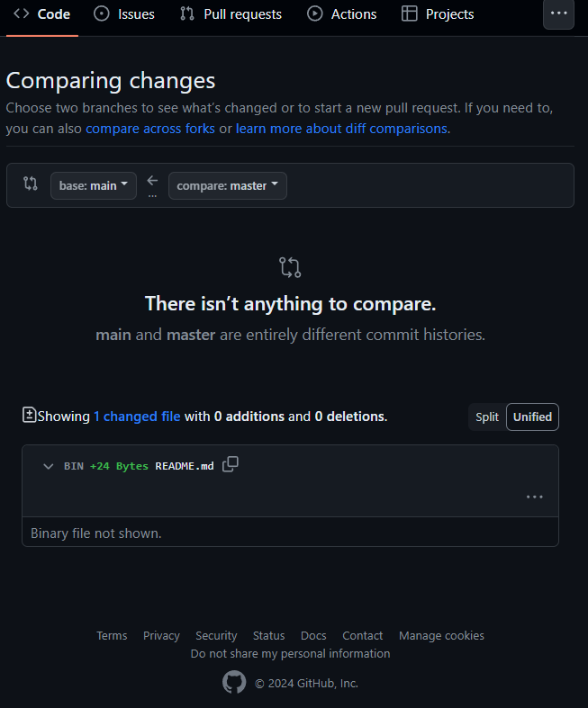

- [问题描述（可以不看）](#问题描述可以不看)
- [最速解决方法（省流）](#最速解决方法省流)


## 问题描述（可以不看）
当本地建立git仓库和远程代码托管平台上建立远程git仓库，两个动作并不匹配的时候，会出现一系列的同步问题。以我本次遇到的情况简述：先在本地建立并初始化一git repo，并在本地多次进行一系列 `git add` 和 `git commit` 操作，搭了本仓库的雏形；

```bash
git init UoB-Software-Tools
cd UoB-Software-Tools
echo "# UOB-Software-Tools" >> README.md
git add README.md
git commit -m "Initialize the repo and generate README.md"
```


使用以下命令push的时候出现报错：

```powershell
PS ~\GameJam> git push

fatal: No configured push destination.
Either specify the URL from the command-line or configure a remote repository 

```

然后想起来要 `git push` 到远程仓库，遂在github上建立了公开同名仓库。**一定注意将线上和本地的两个仓库连接起来**。
```bash
git remote add origin <远程仓库的URL地址>
```

但是当我再次push时依旧报错：

```Powershell
PS C:\Users\Ricardo\Videos\GameJam\GameJam> git push
fatal: The current branch master has no upstream branch.
To push the current branch and set the remote as upstream
```
意味着Git此时没有弄明白，我要将本地这唯一的分支推送到远程仓库的哪个分支。我们必须手动指定，哪怕远程分支只有一个，Git也会要求我们指定。互联网检索的信息告诉我，使用这条命令解决这个问题。**万勿直接**执行这条语句，它给我带来了又一堆麻烦。
```
git push -u origin master
```
这个命令将推送当前本地 master 分支的更改到远程仓库，并将远程仓库的 master 分支设置为本地 master 分支的上游分支。这样，以后再次使用 git push 时，Git 就会自动将更改推送到远程仓库的 master 分支。

问题就出在这里，对于一个本地仓库而言， `git init` 命令初始化全新的仓库后Git不会为用户自动创建任何分支（如果没有任何 `git commit` 记录的话运行 `git branch` 命令，它不会显示任何分支信息）。执行过 `git add` `git commit` 流程后，git创建的本地唯一且默认的分支确实是`master`，**但是远程Github建立仓库时自动生成的唯一默认分支是`main`**。这就导致了我执行上述命令后再进行 `git push` 出现了麻烦，远程仓库出现了两个分支，且本地内容上传成为了非默认分支，两者还无法合并。

理由是两个分支（`main` 和 `master`）之间没有可以比较的内容，因为它们具有完全不同的提交历史记录,甚至有可能不是同一起点（确实如此，本人本地repo是命令行git命令在本地初始化的并将工作区 (working directory) 内容暂存、提交到本地仓库，github托管的远程repo是线上由github初始化的且无任何 `git commit` 记录）。


快刀斩乱麻，展示出目前本地和远程的仓库，在本地建立一个和远程默认仓库分支一致的分支，将本地master分支

```bash
git branch -a #显示所有本地和远程分支
git branch -r #显示远程分支
git branch #显示本地所有分支
```
远程分支会以 `remotes/<remote_name>/<branch_name> ` 的形式显示。我的情况显示为，于是通过 `git pull` 将完整的远程仓库所有分支信息同步过来。
```Powershell
PS > git branch -a
* master
  remotes/origin/master
```

在本地创建一个名为 `main` 的同名新分支，并且切换到这个分支上。新分支的内容是从当前分支（本地 `master` 分支）复制过来的，包括当前分支上的所有文件和提交历史。
```bash
git checkout -b main
```
创建新分支，如果没有将它与远程仓库的分支关联起来，执行 `git push` 命令时，Git 不知道要将更改推送到哪个远程分支会报错（这点前面已经知道，只不过**每个本地分支进行远程分支关联需要手动设置，前面进行的关联映射仅作用于master和remote/master**,这条命令可简化本地远程同名分支的映射`git config --global push.default current
`）。因此执行
```
git config --global push.default current
```
以进行默认自动同名分支映射，

或
```
git branch --set-upstream-to=origin/main main
```
单独设置该分支和远程分支映射关联关系。

然后运行 `git pull origin main --allow-unrelated-histories`使用 `--allow-unrelated-histories` 选项来允许合并不相关的历史记录。
随后的`git push`失败了，原因是存在冲突文件，而`git status`可以揭示在push和pull过程中存在冲突的文件。而由于本地和远程仓库都有`README.md`文件所以显示出来的日志告诉我不管是push还是pull都需要先解决冲突
```powershell
Unmerged paths:
  (use "git add <file>..." to mark resolution)
        both added:      README.md
```
走一遍add、commit的流程可以在本地文件中标记这个文件的冲突之处
```
<<<<<<< HEAD
当前分支的更改

=======
其他分支的更改

>>>>>>> <commit>
```
做好取舍，删除所有有关的标记，最后一记push解千愁。


## 最速解决方法（省流）
Git 本身的冲突问题，可以有更简洁合适的解决方法。

e.g. main分支是远程主分支，本地主分支也是main，dev分支是需要合并到主分支的开发分支；出现冲突无法与主分支合并。此时应当将本地main与远程main同步到最新状态.
```bash
git checkout main
git pull
```
然后再次切换到dev分支，将更新好的main分支合并进来。
```bash
git checkout dev
git merge main
```
Git会自动为我们甄别非共同分支的分歧commit然后高亮到当前的dev分支代码里。这时候缺乏共同母分支点的问题已经被解决了，我们需要手动取舍处理好以后，进行dev分支的add和commit甚至push，最后再提出pull request无冲突地合并到远程主分支。

